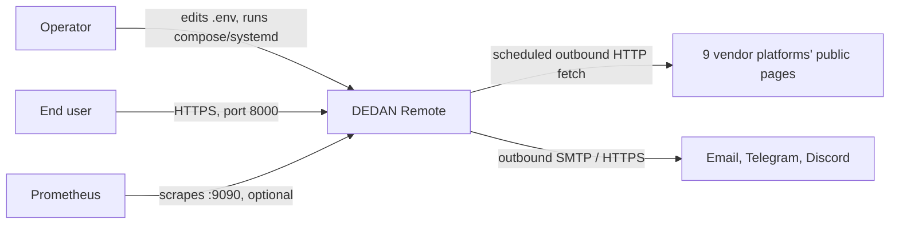
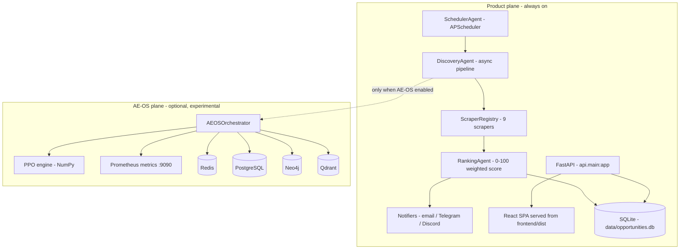
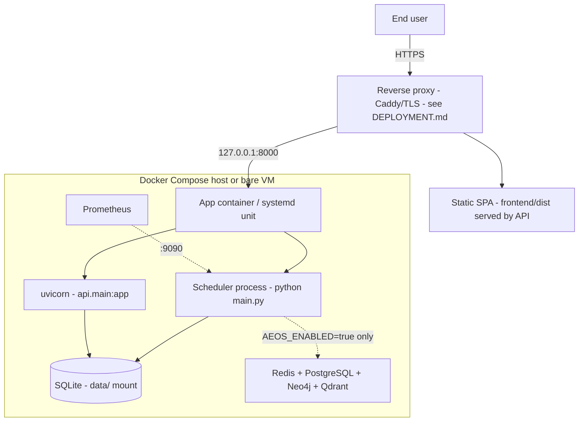

# DEDAN Remote Architecture

This document describes the architecture of DEDAN Remote as implemented in this repository. Source code is the authority; every claim below is traceable to committed code.

## 1. System Context

DEDAN Remote is a self-hosted, single-repository system with three external actor groups: an operator who configures and runs it, end users who browse opportunities through a web application, and third-party platforms whose public listing pages are fetched on a schedule.



- **Operator** — installs dependencies, sets environment variables, runs the scheduler/API or the Docker stack, monitors logs and metrics.
- **End user** — uses the React SPA served on port 8000 (browse, filter, save, inspect opportunities; register/login).
- **Platforms** — Outlier, Alignerr, OneForma, TELUS Digital, Welocalize, Appen, DataAnnotation, Clickworker, Toloka. DEDAN Remote reads public pages only; it does not authenticate to or modify these platforms.
- **Notification channels** — optional email (SMTP/Gmail API), Telegram bot, Discord webhook.

## 2. Architectural Goals

- **Deterministic, auditable scoring** — opportunity scores are produced by weighted arithmetic and rules, not opaque models; every score can be explained from its inputs.
- **I/O-bound throughput** — the pipeline is fully asynchronous (asyncio + aiohttp) because the workload is network-bound.
- **Resilience to third-party instability** — retries with backoff, per-source circuit breakers, and per-scraper fault isolation so one broken platform cannot stall the cycle.
- **Single-process deployability** — the core product runs as one Python process plus one SQLite file; optional subsystems are strictly gated.
- **Testability** — scoring and parsing logic are pure/deterministic; integration tests are Docker-gated and skipped cleanly when Docker is absent.
- **Honesty by default** — experimental components are disabled by default and labeled as such in code and docs.

## 3. Non-Goals

- Not a job-application bot: DEDAN Remote never applies, submits, or authenticates on a user's behalf.
- No LLM inference, generative features, or external model servers in the product path.
- No horizontal scale-out, multi-tenancy, or SaaS control plane.
- No guarantee of third-party platform availability or markup stability; ToS/robots compliance is the operator's responsibility.
- AE-OS research features (PPO control, tiered memory) are not part of the core product's behavior or SLA.

## 4. High-Level Architecture

The system runs two planes inside one Python process:

- **Product plane (always on)** — scheduler, discovery pipeline, ranking, notifications, SQLite persistence, FastAPI service, React SPA.
- **AE-OS plane (optional, experimental)** — tiered memory over Redis/PostgreSQL/Neo4j/Qdrant, Prometheus metrics, and an experimental PPO control loop. Gated by `AEOS_ENABLED=true` or `--aeos` (default: off).



Component classification (deterministic vs. ML vs. experimental) is documented in [docs/AI_ARCHITECTURE.md](docs/AI_ARCHITECTURE.md).

## 5. Runtime Architecture

Two long-lived workloads are started:

| Workload | Bare metal | Docker (compose `command`) |
|---|---|---|
| Discovery scheduler | `python main.py` (runs forever) | `python main.py &` in the app container |
| HTTP API + SPA | `uvicorn api.main:app --port 8000` (separate terminal) | `exec uvicorn api.main:app --host 0.0.0.0 --port 8000 --proxy-headers` |
| Frontend dev server | `npm run dev` (Vite, port 5173, development only) | not used; the SPA is pre-built into the image |

- Both workloads share one SQLite file (`data/opportunities.db`); SQLite handles cross-process access with its own locking, and writes are short-lived insert/update statements.
- In Docker, the scheduler and API run together in one container (`docker-compose.yml` overrides the image's default `CMD`, which starts only the scheduler).
- The AE-OS plane, when enabled, starts inside the scheduler process (`--aeos` or `AEOS_ENABLED=true`) and binds the metrics endpoint on port 9090.

Ports of record: **8000** API + SPA, **9090** Prometheus metrics (AE-OS), **5173** Vite dev server, **9091** Prometheus UI (compose only), plus datastore ports (6379 Redis, 5432 PostgreSQL, 7687 Neo4j, 6333 Qdrant) in the compose stack.

## 6. Discovery Pipeline

```mermaid
flowchart LR
    Sched[Scheduler - cron or interval] --> Reg[ScraperRegistry - pkgutil auto-discovery]
    Reg --> Fetch[Concurrent fetch - aiohttp, semaphore 5,3 retries]
    Fetch --> Parse[Parse - BeautifulSoup / parsel]
    Parse --> Norm[Normalize - models.Job]
    Norm --> Dedup[Deduplication - sha256 source:url [:16]]
    Dedup --> Rank[Ranking - weighted 0-100]
    Rank --> Store[Persist - SQLite insert]
    Store --> Notify[Notify - score threshold gate]
    Notify --> Hist[execution_history - cycle stats]
    Store --> Serve[FastAPI reads SQLite]
    Serve --> UI[React SPA]
```

Real parameters (defaults from `config/settings.py` and `pytest`-verified code):

| Parameter | Value | Source |
|---|---|---|
| Cycle schedule | `CRON_SCHEDULE` five-field cron or `CHECK_INTERVAL` minutes (default 60) | `config/settings.py` |
| Startup run | one cycle fires at scheduler start | `agents/scheduler_agent.py` |
| Overlap guard | `misfire_grace_time=300` | `agents/scheduler_agent.py` |
| Request timeout | `REQUEST_TIMEOUT` (default 30s) | `utils/http_client.py` |
| Retries | `MAX_RETRIES` (default 3), exponential backoff (tenacity) | `utils/http_client.py` |
| Concurrency | `CONCURRENT_SCRAPERS` semaphore (default 5), aiohttp connector limit 20 | `utils/http_client.py` |
| Inter-request delay | `RATE_LIMIT_DELAY` (default 1.0s) | `config/settings.py` |
| Circuit breaker | trip after `CIRCUIT_BREAKER_FAILURE_THRESHOLD` (5) failures, `CIRCUIT_BREAKER_RECOVERY_TIMEOUT` (60s) recovery | `database/database.py` (`website_status`) |
| Dedup key | `sha256(source + ":" + url)[:16]` | `models/job.py` |
| Rank | eight weighted dimensions, weights from `RANKING_WEIGHT_*`, sum = 1.0 | `agents/ranking_agent.py` |
| Notification gate | score >= `MIN_SCORE_FOR_NOTIFICATION` (default 50) | `notifications/notifier.py` |
| Cycle bookkeeping | `execution_history` row with duration, counts, first 10 errors | `database/database.py` |

Per-scraper failures are isolated: a scraper that raises is recorded in the cycle's error list and the remaining scrapers still run. Full narrative: [docs/DISCOVERY_PIPELINE.md](docs/DISCOVERY_PIPELINE.md).

## 7. API Architecture

- **Application** — FastAPI app in `api/main.py` (`api.main:app`), served by uvicorn; OpenAPI docs at `/docs`.
- **Routers** — `api/routers/`: `jobs` (catalog, search, detail, save/unsave), `auth` (register/login/logout/me), `user` (saved jobs, applications, profile, recommendations), `discovery` (search, sources, categories, notifications-read), `system` (operator diagnostics), `meta` (health/readiness). Every route also has an `/api/v1` alias.
- **Validation** — Pydantic request/response schemas in `api/schemas.py`; malformed input is rejected with a structured error envelope (see [docs/API.md](docs/API.md)).
- **Authentication** — register/login issues an opaque session token (stored in the `sessions` table, presented as `Authorization: Bearer <token>`), with bcrypt password hashing (`api/routers/auth.py`, `api/security.py`); system routes require the `DEDAN_SYSTEM_TOKEN` header; the job catalog and health probes are unauthenticated by design.
- **Static serving** — after `npm run build`, the SPA in `frontend/dist` is mounted so one origin serves UI and API.
- **Cross-cutting** — CORS allowlist (`DEDAN_CORS_ORIGINS`), optional HSTS and proxy-header trust (`DEDAN_ENABLE_HSTS`, `DEDAN_TRUST_PROXY`) for production deployments.

## 8. Frontend Architecture

- React 18 + TypeScript, bundled by Vite; production build is `tsc && vite build` (type-checked build).
- Pages: opportunity list/detail, saved items, profile/preferences, dashboard, auth screens, and a placeholder Assistant page (client-simulated responses — no backend; see Known Limitations).
- Data access goes through `frontend/src/lib` API client wrappers against `/api` on the same origin.
- Tests: Vitest (`npx vitest run`) — 4 test files, 17 tests, covering components and API query behavior.
- The build runs in CI on every push; the image build embeds `frontend/dist` (frontend `node_modules` and source are not shipped in the runtime layers).

## 9. Persistence Architecture

| Store | Role | Required? | Details |
|---|---|---|---|
| SQLite (`data/opportunities.db`) | Product store: `jobs`, `notifications`, `execution_history`, `website_status` | **Yes** | Accessed synchronously via `database/database.py`; short transactions; file-backed, survives restarts; backup via `scripts/backup.sh` |
| PostgreSQL (`aeos_episodic`) | AE-OS episodic memory: milestones, dead-letter queue, PPO reward ledger | No (AE-OS only) | Async pool via `database/postgres_database.py`; absent DSN degrades AE-OS features |
| Redis | AE-OS working memory + keyspace-notification listener (`__keyevent@0__:expired`) | No (AE-OS only) | TTL-based expiry hands off to longer-lived memory tiers |
| Qdrant | AE-OS vector memory, 384-dim cosine collection `tier3_episodic_embeddings` | No (AE-OS only) | Vectors are deterministic hash embeddings (no model server) |
| Neo4j | AE-OS epistemic/causal graph (CAUSES edges) | No (AE-OS only) | Degrades to a logging mock when the driver is absent |

Consistency: the product path only needs SQLite durability and last-writer-wins semantics; AE-OS stores are best-effort telemetry/memory where loss is acceptable. Entity relationships and lifetimes: [docs/DATA_MODEL.md](docs/DATA_MODEL.md).

## 10. Notification Architecture

- `notifications/notifier.py` dispatches a scored job to every **enabled** channel: email (`email_notifier.py`, SMTP or Gmail API), Telegram (`telegram_notifier.py`), Discord (`discord_notifier.py`).
- Gate: score >= `MIN_SCORE_FOR_NOTIFICATION` (default 50), evaluated per job during the discovery cycle.
- Delivery outcomes are written to the `notifications` table per channel (`mark_notified`), giving an auditable delivery log.
- Failure handling: channel errors are caught and logged; a failing channel does not abort the cycle or block other channels. With no channel enabled the pipeline runs silently (documented limitation).
- Templates carry the DEDAN Remote identity and deep-link to the hosted UI.

## 11. AE-OS Architecture

AE-OS is an **optional, experimental** orchestration and memory subsystem. It is off by default (`AEOS_ENABLED=false`) and started only via `--aeos` or the environment flag.

Startup order inside `core/orchestrator.py` (`AEOSOrchestrator`):

1. Prometheus HTTP endpoint on port 9090 (`aeos_*` metrics).
2. Redis keyspace listener for expiry events.
3. Neo4j sync worker (graph consolidation; mock fallback without the driver).
4. PostgreSQL episodic memory pool (when DSN configured).
5. Qdrant vector index (hash embeddings).
6. Main loop every 60s: heartbeat/telemetry bookkeeping and the PPO step.

**PPO control loop (`core/ppo_engine.py`)** — a NumPy MLP (12-64-64-8) over 12 telemetry features with 8 discrete actions (concurrency/rate-limit/min-score adjustments, circuit reset, noop). Runtime wiring is **partial**: only `reset_circuits` has a handler with observable effect; the other actions log intent without mutating live worker pools, and reward bookkeeping is largely synthetic. Status: EXPERIMENTAL — see [docs/AI_ARCHITECTURE.md](docs/AI_ARCHITECTURE.md).

Failure behavior: missing datastores degrade to logging-only behavior rather than crashing the scheduler.

## 12. Observability

- **Logs** — stdlib `RotatingFileHandler` with a JSON formatter to `logs/dedan_remote.log` (rotation configured in `utils/logger.py`); console output for development; each discovery cycle logs start/finish, per-scraper results, and errors.
- **Metrics** — `aeos_*` counters/gauges/histograms on `:9090/metrics` (exposed when AE-OS is enabled; scraped by `prometheus.yml`, UI on 9091 in compose). Metrics are AE-OS-scoped; the plain product path has no separate metrics registry.
- **Health** — `GET /api/health` (liveness) and `GET /api/ready` (readiness) from the `meta` router; container healthcheck runs a SQLite connect probe.
- **Cycle audit** — `execution_history` stores duration, jobs found/new/notified, and the first 10 error strings per cycle; `python main.py --stats` prints aggregates.
- **API activity** — `api/activity.py` records recent API activity for the dashboard.

Details and metric names: [docs/OBSERVABILITY.md](docs/OBSERVABILITY.md).

## 13. Security Boundaries

- **Secrets** — only in `.env` (gitignored); no credentials in code or images; `.env.example` documents every variable without values.
- **Input handling** — Pydantic validation on API inputs; scraper output is sanitized before storage; all SQL uses parameterized queries.
- **Authentication/authorization** — bcrypt-hashed user sessions; `DEDAN_SYSTEM_TOKEN` gates system routes; job catalog reads are intentionally public on a self-hosted instance.
- **HTTP posture** — configurable CORS allowlist, optional HSTS, proxy-header trust for reverse-proxy deployments.
- **Outbound** — scraper URLs are fixed constants in code (no user-supplied fetch targets, which bounds SSRF exposure); the API Sentinel adds idempotency + rate limiting for its enumerated connectors only (job scraping is not wrapped by it).
- **Dependencies/CI** — Dependabot updates, CodeQL + Bandit scanning (`security.yml`), Ruff and mypy in CI; no container registry publishing from CI.
- **Rate limiting** — per-IP sliding-window limits per route bucket (e.g. auth 10/min, jobs 240/min, search 180/min) returning 429 with `Retry-After` (`api/deps.py`); identity from `client_ip` so it works behind a trusted proxy.
- **Not claimed** — no WAF, no OAuth2, no protection for this instance against determined scrapers. Full inventory with implemented/not-implemented status: [SECURITY.md](SECURITY.md).

## 14. Failure Handling

| Failure | Handling | Evidence |
|---|---|---|
| Platform timeout / 5xx | Tenacity retries (default 3) with exponential backoff, then scraper reports failure | `utils/http_client.py` |
| Repeated source failures | Per-source circuit breaker opens after 5 consecutive failures; recovery window 60s; state in `website_status` | `database/database.py` |
| One scraper crashes | Cycle continues; error recorded in `execution_history.errors`, other scrapers still run | `agents/discovery_agent.py` |
| Notification channel down | Error caught and logged; other channels still attempted; outcome logged per channel | `notifications/` |
| AE-OS datastore missing | Component degrades to logging/mock (Neo4j) or skips (PG/Qdrant); scheduler keeps running | `core/orchestrator.py` |
| Process crash | Container healthcheck detects DB failure; `Restart=always` (systemd) or compose restart policy resumes the service | `docker-compose.yml`, README systemd unit |
| Overlapping cycles | APScheduler misfire grace + overlap guard prevents concurrent cycles | `agents/scheduler_agent.py` |

## 15. Scaling Model

- **Vertical only.** Throughput scales with single-host CPU/network: asyncio concurrency (semaphore 5, connector 20) is deliberately conservative to avoid IP blocks on third-party platforms.
- **SQLite is the write bottleneck by design** — acceptable for one scheduler process and a read-mostly API; migration to PostgreSQL would be the lever if write volume grew (async module already exists).
- **No horizontal scaling** — multiple replicas would duplicate scrape cycles; there is no leader election or queue.
- Test parallelism uses `pytest-xdist` (`-n auto`); this does not affect runtime architecture.

## 16. Deployment Model



Supported targets:

1. **Docker Compose** (recommended) — `docker compose up --build -d`; app + datastores as declared in `docker-compose.yml`; validated in CI by `docker compose config` and a full image build.
2. **Bare metal / systemd** — `python main.py` under a systemd unit (example in README), API via uvicorn; DEPLOYMENT.md covers reverse proxy, TLS, and the production environment checklist.
3. **Development** — backend (`uvicorn --reload`) + Vite dev server (`npm run dev`) against local SQLite.

CI never publishes images; images are built locally or by the operator.

## 17. Architectural Tradeoffs

| Decision | Chosen | Rejected | Rationale |
|---|---|---|---|
| Scoring | Deterministic weights + rules | Learned/LLM ranking | Explainability, zero infra, testable; ML remains roadmap |
| Store | SQLite file | PostgreSQL for product path | Single-process simplicity; PG module exists for when scale demands it |
| Process model | Scheduler + API on one host | Distributed workers/queue | Operationally simple for one operator; scrape rate is low |
| Scraping | Public HTML parsing | Official APIs (mostly unavailable/limited) | Coverage now; fragility accepted and mitigated with circuit breakers |
| AE-OS embeddings | Deterministic hash vectors | Sentence-transformer model | No model server to operate; semantic quality explicitly not claimed |
| Naming | `*Agent` classes kept | Wholesale rename | Names are historical; docs now classify them honestly as services/orchestrators |

## 18. Known Limitations

1. **No horizontal scaling** — single host, single scheduler; SQLite is single-writer.
2. **AE-OS PPO is experimental and partially wired** — only `reset_circuits` affects runtime; other actions log intent; disabled by default.
3. **Qdrant vectors are hash embeddings** — deterministic 384-dim, not semantic embeddings.
4. **Neo4j degrades to a logging mock** when the driver package is absent.
5. **API Sentinel scope** — guards only its four enumerated commerce connectors; job scraping paths are not wrapped by it.
6. **Email needs SMTP credentials or a Gmail App Password** — no OAuth2 flow.
7. **No enabled notification channel means silent operation** — discovery still runs and the UI still updates.
8. **Scrapers break when platforms change markup** — mitigated by fault isolation, not eliminated.
9. **Assistant page is a placeholder** — client-side simulated responses, no backend AI (`frontend/src/pages/AssistantPage.tsx`).
10. **Product-path metrics** — the `aeos_*` registry is exposed only with AE-OS; the plain product relies on logs and `execution_history`.

## 19. Future Architecture

Tracked in [ROADMAP.md](ROADMAP.md) — none of this exists today: RSS feed output, Slack notifier, additional scrapers, ML-based matching, and deeper PPO integration. Architecture decision records live in [docs/decisions/](docs/decisions/).
