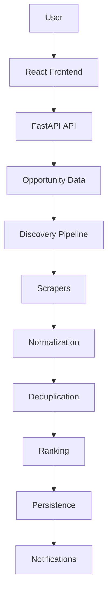

# DEDAN Remote

[](https://github.com/Dan12-dev-ai/dedan-remote/actions/workflows/ci.yml)
[](https://www.python.org/downloads/)
[](LICENSE)

DEDAN Remote is a self-hosted service that periodically collects publicly available remote AI-work listings from nine vendor platforms, normalizes and deduplicates them, assigns a configurable 0-100 relevance score, and exposes the resulting dataset through a FastAPI service, a React web application, and notification channels.

## Overview

**Problem.** AI-data and micro-task opportunities are scattered across many vendor platforms. Checking them manually is slow, and promising listings are easily missed.

**System.** DEDAN Remote runs a scheduled asynchronous discovery pipeline (fetch, parse, normalize, deduplicate, rank, persist) over nine platform scrapers, then serves the stored opportunities through a REST API and a single-page web application. Listings whose score meets a configurable threshold are pushed to configured notification channels (email, Telegram, Discord).

**Users.** Independent contractors evaluating AI-data work platforms, and operators who want a self-hosted, auditable discovery service.

**Result.** A continuously updated, ranked, deduplicated local dataset of remote AI-work opportunities, with per-channel notification delivery logs and a browsable web UI.

## Key Capabilities

- **9 platform scrapers** — Outlier, Alignerr, OneForma, TELUS Digital, Welocalize, Appen, DataAnnotation, Clickworker, Toloka. New platforms are added by subclassing `BaseScraper`; `ScraperRegistry` auto-discovers them.
- **Deterministic ranking** — every opportunity is scored 0-100 across eight configurable weighted dimensions (see [Intelligence / AI](#intelligence--ai)).
- **Scheduled discovery** — APScheduler-driven cycles (five-field cron or interval, default 60 minutes) with overlap prevention and one run at startup.
- **Resilient fetching** — per-scraper timeouts, up to 3 retries with exponential backoff, semaphore-limited concurrency, and per-source circuit breakers.
- **Notifications** — email (SMTP or Gmail API), Telegram bot, Discord webhook. Fires when score >= `MIN_SCORE_FOR_NOTIFICATION` (default 50); delivery is recorded per channel.
- **REST API + web UI** — FastAPI service with authenticated user features, filtering, and pagination; React SPA served from the same host (see [docs/API.md](docs/API.md)).
- **Docker deployment** — multi-stage image plus a compose stack (app, Redis, PostgreSQL, Neo4j, Qdrant, Prometheus).
- **Testing and CI** — pytest suite (unit, security, property-based, and Docker-gated integration tests), Vitest frontend tests, Ruff, mypy, and a Docker build check, all enforced by GitHub Actions.

## Architecture



The discovery pipeline produces and persists opportunity data; the API reads that data and serves it to the frontend; notifications are emitted from the persistence stage when the score threshold is met.

**AE-OS (optional, experimental).** A separate orchestration and memory subsystem — tiered memory over Redis, PostgreSQL, Neo4j, and Qdrant, Prometheus metrics, and an experimental PPO control loop — can be enabled with `AEOS_ENABLED=true` (default: disabled). No core capability depends on it. See [ARCHITECTURE.md](ARCHITECTURE.md) and [docs/AI_ARCHITECTURE.md](docs/AI_ARCHITECTURE.md).

Full detail: [ARCHITECTURE.md](ARCHITECTURE.md).

## Discovery Pipeline

1. **Scheduler** (`SchedulerAgent`, APScheduler) fires a discovery cycle on cron/interval; overlap is guarded.
2. **Scraper registry** auto-discovers the nine scrapers in `scrapers/`.
3. **Concurrent fetch** — `aiohttp` with semaphore 5, connector limit 20, `REQUEST_TIMEOUT` 30s, up to 3 attempts (tenacity exponential backoff), inter-request delay, and a per-source circuit breaker (trip after 5 failures, 60s recovery window).
4. **Parse and normalize** — platform-specific parsers produce `models.Job` records.
5. **Deduplicate** — job id is `sha256(source + ":" + url)[:16]`; ids already present in SQLite are skipped.
6. **Rank** — `RankingAgent` computes the weighted 0-100 score.
7. **Persist** — new rows are written to SQLite (`data/opportunities.db`); the cycle is stamped in `execution_history` with counts and errors.
8. **Notify** — jobs scoring >= 50 are pushed to enabled channels; `mark_notified` records which channels succeeded.
9. **Serve** — FastAPI exposes the stored opportunities to the React frontend.

Timeouts, retries, failure behavior, and concurrency details: [docs/DISCOVERY_PIPELINE.md](docs/DISCOVERY_PIPELINE.md).

## Intelligence / AI

The product path contains **no LLM calls and no external model servers**. The components below are distinct and must not be conflated:

| Concern | Where | What it actually is | Status |
|---|---|---|---|
| Deterministic ranking | `agents/ranking_agent.py` | Eight weighted dimensions (remote, worldwide, salary, beginner, AI-related, English, simplicity, freshness), weights from `.env` (`RANKING_WEIGHT_*`, must sum to 1.0). Pure arithmetic; no learned parameters. | Implemented |
| Heuristic scoring | `intelligence/` | Rule- and keyword-based evaluators: eligibility rules, skill-taxonomy keyword matching, difficulty bands, success-probability heuristic, and a composite scorer. Deterministic. | Implemented |
| Machine learning | `core/ppo_engine.py` | NumPy PPO network (12-64-64-8 MLP) inside AE-OS, intended to adjust scraping parameters. Only the `reset_circuits` action has a runtime handler; other actions log intentions. Disabled by default (`AEOS_ENABLED=false`). | Experimental |
| LLM functionality | — | None. No OpenAI/Anthropic/other LLM API calls exist in the codebase. | Not present |
| Agent orchestration | `agents/` | The classes named `*Agent` are ordinary Python services: `SchedulerAgent` (timing), `DiscoveryAgent` (pipeline orchestration), `RankingAgent` (scoring). No autonomous decision loop, no planning, no tool use. | Implemented |
| AE-OS | `core/` | Optional orchestration and memory subsystem (tiered memory, Prometheus metrics, experimental PPO loop). Off by default. | Experimental |

Classification details: [docs/AI_ARCHITECTURE.md](docs/AI_ARCHITECTURE.md).

## Technology Stack

| Layer | Technology | Purpose | Status |
|---|---|---|---|
| Language | Python 3.11+ (3.12 in runtime image) | Async I/O-bound discovery pipeline | Implemented |
| API | FastAPI + uvicorn | REST API and SPA serving | Implemented |
| Scheduling | APScheduler 3 | Cron/interval cycles with overlap prevention | Implemented |
| Scraping | aiohttp + tenacity + BeautifulSoup/parsel/lxml | Fetch, retry, and parse listing pages | Implemented |
| Scoring | NumPy-free weighted arithmetic + heuristics | 0-100 ranking | Implemented |
| Product store | SQLite (`data/opportunities.db`) | Jobs, notifications, execution history, source health | Implemented |
| Frontend | React 18 + Vite + TypeScript | Single-page web application | Implemented |
| Notifications | smtplib, python-telegram-bot, discord-webhook | Email, Telegram, Discord delivery | Implemented |
| Config | pydantic-settings + python-dotenv | Typed settings from `.env` | Implemented |
| Observability | Rotating JSON logs; prometheus-client (`aeos_*` metrics on :9090) | Logging and metrics | Implemented |
| AE-OS memory | Redis 7, PostgreSQL 16, Neo4j 5, Qdrant | Optional tiered memory | Experimental (optional) |
| AE-OS RL | NumPy PPO (`core/ppo_engine.py`) | Experimental control loop | Experimental (partially wired) |
| CI | GitHub Actions | Lint, type check, tests, frontend build, Docker build check | Implemented |

## Repository Structure

```
├── main.py              # CLI entry point (scheduler, --once, --stats, --setup, --aeos)
├── agents/              # SchedulerAgent, DiscoveryAgent, RankingAgent
├── api/                 # FastAPI app, routers, schemas, security
├── config/              # pydantic-settings Settings model
├── core/                # AE-OS: orchestrator, sentinel, PPO engine, metrics
├── database/            # SQLite (sync) and PostgreSQL (async) access
├── docs/                # API, data model, pipeline, testing, security, ADRs
├── frontend/            # React + Vite + TypeScript SPA
├── intelligence/        # Deterministic scoring and eligibility heuristics
├── models/              # Job dataclass and deterministic id generation
├── notifications/       # Email, Telegram, Discord notifiers
├── scrapers/            # 9 platform scrapers (BaseScraper + auto-registration)
├── scripts/             # deploy, status, stop, backup shell scripts
├── tests/               # pytest suite (unit, security, property, integration)
├── utils/               # Async HTTP client, structured logger
├── .github/             # CI workflows, issue/PR templates, Dependabot
├── docker-compose.yml   # App + datastores stack
└── Dockerfile           # Multi-stage build (frontend + backend)
```

## Quick Start

Prerequisites: Python 3.11+, Node.js 18+ (frontend only), optionally Docker.

```bash
# 1. Clone
git clone https://github.com/Dan12-dev-ai/dedan-remote.git
cd dedan-remote

# 2. Backend environment
python -m venv venv
source venv/bin/activate
pip install -r requirements.txt

# 3. Frontend dependencies (only needed for UI development)
cd frontend && npm install && cd ..

# 4. Configure
cp .env.example .env

# 5. Initialize the database and run one discovery cycle
python main.py --setup
python main.py --once

# 6. Start the scheduler (runs forever)
python main.py

# 7. In another terminal: API server
uvicorn api.main:app --reload --host 0.0.0.0 --port 8000

# 8. In another terminal: frontend dev server (http://localhost:5173)
cd frontend && npm run dev
```

CLI reference:

```bash
python main.py            # Start scheduler (runs forever)
python main.py --once     # Single discovery cycle
python main.py --stats    # Database statistics
python main.py --setup    # Create database tables
python main.py --aeos     # Start scheduler with AE-OS (experimental) enabled
```

## Docker

Verified commands against the committed `docker-compose.yml`:

```bash
docker compose config -q            # Validate the compose file
docker compose up --build -d        # Build and start the full stack
docker compose logs -f              # Follow logs
docker compose run --rm dedan-remote python main.py --once   # One cycle
docker compose down                 # Stop
```

The app container runs the scheduler and uvicorn together and publishes:

| Port | Service |
|---|---|
| 8000 | REST API + built SPA |
| 9090 | Prometheus metrics (`aeos_*`, AE-OS enabled only) |

Redis, PostgreSQL, Neo4j, Qdrant, and Prometheus are started as supporting services for AE-OS; the core product only requires the app container and SQLite.

## Configuration

All configuration comes from environment variables loaded from `.env` — see [.env.example](.env.example) for the full, commented list. Key groups:

- **Schedule** — `CHECK_INTERVAL` (minutes), `CRON_SCHEDULE`
- **Scraping** — `REQUEST_TIMEOUT`, `MAX_RETRIES`, `CONCURRENT_SCRAPERS`, `RATE_LIMIT_DELAY`
- **Ranking** — `RANKING_WEIGHT_*` (eight weights, sum to 1.0), `MIN_SCORE_FOR_NOTIFICATION`
- **Notifications** — `EMAIL`/`EMAIL_PASSWORD` (SMTP), `USE_GMAIL_API`, `ENABLE_TELEGRAM`, `ENABLE_DISCORD`
- **Resilience** — `CIRCUIT_BREAKER_FAILURE_THRESHOLD`, `CIRCUIT_BREAKER_RECOVERY_TIMEOUT`
- **AE-OS (optional)** — `AEOS_ENABLED` (default `false`), datastore DSNs
- **API security** — `DEDAN_SYSTEM_TOKEN`, `DEDAN_CORS_ORIGINS`, `DEDAN_ENV`, `DEDAN_ENABLE_HSTS`

Secrets never live in code; `.env` is gitignored. See [SECURITY.md](SECURITY.md).

## Testing

Exact commands:

```bash
pytest                                # full suite (pytest.ini defaults: parallel, coverage)
pytest -m "not integration and not property_based"   # CI-equivalent unit run
pytest -m property_based -v           # Hypothesis property-based tests
pytest -m security -v                 # security tests
pytest -m integration -v              # integration tests (requires Docker: PostgreSQL, Redis)
cd frontend && npx vitest run         # frontend unit tests
```

Last verified on `master` (2026-09-28):

- Full pytest suite: **304 passed, 46 skipped, 0 failed** (350 collected). Skips are Docker- and credential-gated tests (integration containers, optional service credentials).
- Frontend Vitest: **17 passed, 0 failed** (4 test files).
- CI (`.github/workflows/ci.yml`) additionally enforces Ruff lint/format, mypy, coverage report generation, the frontend production build, and a Docker image build (no push) on every push and pull request to `master`.

Details and test taxonomy: [docs/TESTING.md](docs/TESTING.md).

## Deployment

See [DEPLOYMENT.md](DEPLOYMENT.md) for Docker, bare-metal (systemd), and reverse-proxy (Caddy/TLS) deployments, including the production environment checklist.

## Architecture Documentation

- [ARCHITECTURE.md](ARCHITECTURE.md) — system context, runtime architecture, failure handling, scaling, tradeoffs, limitations
- [docs/DISCOVERY_PIPELINE.md](docs/DISCOVERY_PIPELINE.md) — pipeline stages with real timeouts and concurrency values
- [docs/DATA_MODEL.md](docs/DATA_MODEL.md) — SQLite, PostgreSQL, Redis, Qdrant, Neo4j: roles and lifetimes
- [docs/API.md](docs/API.md) — endpoint reference generated from the FastAPI routes
- [docs/AI_ARCHITECTURE.md](docs/AI_ARCHITECTURE.md) — component classification (deterministic vs. experimental)
- [docs/OBSERVABILITY.md](docs/OBSERVABILITY.md) — logs, metrics, health endpoints
- [PROJECT_STATUS.md](PROJECT_STATUS.md) — implemented / partial / experimental status by area
- [docs/decisions/](docs/decisions/) — architecture decision records

## Security

Secrets live only in `.env` (gitignored); SQL uses parameterized queries; outbound scraping targets are fixed in code; the API guards system routes with a token and supports CORS allowlists, HSTS, and proxy settings. Dependency and code scanning run via Dependabot, CodeQL, and Bandit. Full control inventory and threat notes: [SECURITY.md](SECURITY.md).

## Project Status

See [PROJECT_STATUS.md](PROJECT_STATUS.md) for per-area status classifications (implemented, verified, partial, experimental, planned) and [ROADMAP.md](ROADMAP.md) for planned work.

## Known Limitations

- **Single-process architecture** — the scheduler and API share one host; no horizontal scaling; SQLite is a single-writer store.
- **Scrapers depend on third-party HTML** — platform layout changes can break parsers; per-source circuit breakers limit the blast radius. Compliance with each platform's terms of service is the operator's responsibility.
- **No LLM functionality** — ranking and eligibility are deterministic. The AE-OS PPO control loop is experimental, disabled by default, and only partially wired to runtime behavior.
- **AE-OS vector memory uses deterministic hash embeddings**, not a semantic embedding model.
- **Neo4j graph sync degrades to a logging mock** when the `neo4j` driver is absent.
- **Email notifications require SMTP credentials or a Gmail App Password** (no OAuth2 flow). With no notification channel enabled, discovery runs silently.
- **The API Sentinel intercepts only its enumerated commerce connectors**; the job-scraping HTTP paths are not wrapped by it.
- **The web UI's Assistant page is a placeholder** — responses are simulated client-side and no backend AI exists (see the `TODO` in `frontend/src/pages/AssistantPage.tsx`).

## Roadmap

Future work only — see [ROADMAP.md](ROADMAP.md).

## Contributing

See [CONTRIBUTING.md](CONTRIBUTING.md) for branching, style, test, and pull-request requirements, and [SECURITY.md](SECURITY.md) for vulnerability reporting. All changes land on `master` via pull requests validated by CI.

## License

MIT — see [LICENSE](LICENSE).

## Disclaimer

DEDAN Remote fetches publicly available listings. Respect each platform's terms of service and robots.txt; the authors accept no responsibility for misuse.
