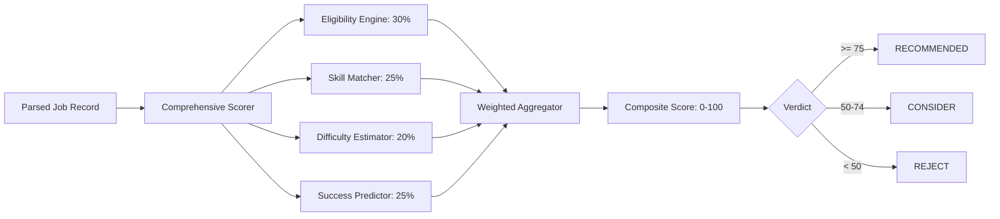

# AI Architecture & Scoring Intelligence — DEDAN Remote

DEDAN Remote clearly separates **deterministic evaluation engines** from **experimental learning models** to maintain strict engineering truthfulness and operational predictability.

---

## 1. Classification of Intelligence Components

| Component | Path | Architecture Class | Description & Status |
|---|---|---|---|
| **Comprehensive Scorer** | `intelligence/scorer.py` | Deterministic Multi-Criteria Evaluator | Produces composite opportunity score (0–100) using weighted sub-scores. **Implemented & Verified**. |
| **Eligibility Engine** | `intelligence/eligibility.py` | Rule-Based Expert System | Evaluates geographic barriers, citizenship requirements, and payout restrictions (with emphasis on Ethiopia & emerging market talent). **Implemented & Verified**. |
| **Skill Matcher** | `intelligence/skill_matcher.py` | Taxonomy & Keyword Matcher | Matches job descriptions against 10 domain skill taxonomies (AI training, coding, evaluation, translation, RLHF). **Implemented & Verified**. |
| **Difficulty Estimator** | `intelligence/difficulty_estimator.py` | Heuristic Text Classifier | Computes learning curve, application friction, and test complexity into 5 difficulty bands. **Implemented & Verified**. |
| **Success Predictor** | `intelligence/success_predictor.py` | Probabilistic Heuristic Model | Estimates acceptance probability (0–100%) based on candidate friction vs. requirement density. **Implemented & Verified**. |
| **AE-OS PPO Engine** | `core/ppo_engine.py` | Reinforcement Learning Model (PPO) | In-memory policy gradient neural network adjusting scraping concurrency and rate limits. **Experimental / Isolated**. |

---

## 2. Deterministic Scoring Pipeline

The standard product path does **not** rely on external LLM APIs (such as OpenAI or Anthropic) for routine opportunity discovery. Instead, it utilizes high-throughput, predictable deterministic heuristics executing in sub-millisecond latencies.

### Sub-Score Formulations
1. **Eligibility Score (30% weight)**:
   - Evaluates worldwide availability (+20)
   - Checks absence of regional restrictions (US-only, EU-only flags deduct up to 50 points)
   - Verifies accessible payment methods (Wise, Payoneer, Crypto, PayPal)
2. **Skill Match Score (25% weight)**:
   - Matches keywords against tokenized categories: AI Data Training, Prompt Engineering, Evaluation, Translation, Software Development.
3. **Difficulty Score (20% weight)**:
   - Detects low-barrier indicators ("no experience needed", "immediate start")
   - High test requirements or mandatory technical portfolios reduce the score.
4. **Success Predictor (25% weight)**:
   - Balances competition indicators, vacancy age, and requirement breadth.

---

## 3. Experimental Control Plane: AE-OS PPO Engine

Located in `core/ppo_engine.py`, the Proximal Policy Optimization (PPO) engine is an optional experimental control loop for the autonomous environment operating system (AE-OS).

### Architecture & Hyperparameters
- **Observation Space (State Vector)**: 12 normalized telemetry features:
  - Jobs discovered per hour, unique jobs rate, notification rate, average score, error rate, open circuit breakers count, execution duration, concurrency level, rate limit events, treasury balance, memory utilization, and time of day.
- **Action Space**: 8 discrete system actions:
  - `0`: `increase_concurrency`
  - `1`: `decrease_concurrency`
  - `2`: `increase_rate_limit`
  - `3`: `decrease_rate_limit`
  - `4`: `increase_min_score`
  - `5`: `decrease_min_score`
  - `6`: `reset_circuits`
  - `7`: `noop`
- **Network Architecture**: 2-layer MLP (`12` -> `64` -> `64` -> `8`) with Softmax policy head and linear Value function head.
- **Reward Formulation**:
  $$\text{Reward} = \Delta\text{Net Profit} - \text{Risk Index} - \text{Overhead}$$

### Implementation Limitations
- Runtime enforcement of actions is currently limited: action `6` (`reset_circuits`) executes a circuit breaker reset stub; other dynamic concurrency adaptations log intentions without fully mutating live worker thread pools.
- It is disabled by default in production (`AEOS_ENABLED=false`).
