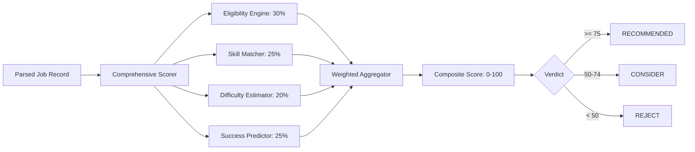

# AI Architecture & Scoring Intelligence — DEDAN Remote

DEDAN Remote clearly separates **deterministic evaluation engines** from **experimental learning models** to maintain strict engineering truthfulness and operational predictability.

---

## 1. Classification of Intelligence Components

| Component | Path | Architecture Class | Description & Status |
|---|---|---|---|
| **Comprehensive Scorer** | `intelligence/scorer.py` | Deterministic Multi-Criteria Evaluator | Produces composite opportunity score (0–100) using weighted sub-scores. **Implemented & Verified**. |
| **Eligibility Engine** | `intelligence/eligibility.py` | Rule-Based Expert System | Evaluates geographic barriers, citizenship requirements, and payout restrictions (with emphasis on Ethiopia & emerging market talent). **Implemented & Verified**. |
| **Skill Matcher** | `intelligence/skill_matcher.py` | Taxonomy & Keyword Matcher | Matches job descriptions against 10 domain skill taxonomies (AI training, coding, evaluation, translation, RLHF). **Implemented & Verified**. |
| **Difficulty Estimator** | `intelligence/difficulty_estimator.py` | Heuristic Text Classifier | Computes learning curve, application friction, and test complexity into 5 difficulty bands. **Implemented & Verified**. |
| **Success Predictor** | `intelligence/success_predictor.py` | Probabilistic Heuristic Model | Estimates acceptance probability (0–100%) based on candidate friction vs. requirement density. **Implemented & Verified**. |
| **AE-OS PPO Engine** | `core/ppo_engine.py` | Reinforcement Learning Model (PPO) | In-memory policy gradient neural network adjusting scraping concurrency and rate limits. **Experimental / Isolated**. |

---

## 2. Deterministic Scoring Pipeline

The standard product path does **not** rely on external LLM APIs (such as OpenAI or Anthropic) for routine opportunity discovery. Instead, it utilizes high-throughput, predictable deterministic heuristics executing in sub-millisecond latencies.

### Sub-Score Formulations
1. **Eligibility Score (30% weight)**:
   - Evaluates worldwide availability (+20)
   - Checks absence of regional restrictions (US-only, EU-only flags deduct up to 50 points)
   - Verifies accessible payment methods (Wise, Payoneer, Crypto, PayPal)
2. **Skill Match Score (25% weight)**:
   - Matches keywords against tokenized categories: AI Data Training, Prompt Engineering, Evaluation, Translation, Software Development.
3. **Difficulty Score (20% weight)**:
   - Detects low-barrier indicators ("no experience needed", "immediate start")
   - High test requirements or mandatory technical portfolios reduce the score.
4. **Success Predictor (25% weight)**:
   - Balances competition indicators, vacancy age, and requirement breadth.

---

## 3. Experimental Control Plane: AE-OS PPO Engine

Located in `core/ppo_engine.py`, the Proximal Policy Optimization (PPO) engine is an optional experimental control loop for the autonomous environment operating system (AE-OS).

### Architecture & Hyperparameters
- **Observation Space (State Vector)**: 12 normalized telemetry features:
  - Jobs discovered per hour, unique jobs rate, notification rate, average score, error rate, open circuit breakers count, execution duration, concurrency level, rate limit events, treasury balance, memory utilization, and time of day.
- **Action Space**: 8 discrete system actions:
  - `0`: `increase_concurrency`
  - `1`: `decrease_concurrency`
  - `2`: `increase_rate_limit`
  - `3`: `decrease_rate_limit`
  - `4`: `increase_min_score`
  - `5`: `decrease_min_score`
  - `6`: `reset_circuits`
  - `7`: `noop`
- **Network Architecture**: 2-layer MLP (`12` -> `64` -> `64` -> `8`) with Softmax policy head and linear Value function head.
- **Reward Formulation**:
  $$\text{Reward} = \Delta\text{Net Profit} - \text{Risk Index} - \text{Overhead}$$

### Implementation Limitations
- Runtime enforcement of actions is currently limited: action `6` (`reset_circuits`) executes a circuit breaker reset stub; other dynamic concurrency adaptations log intentions without fully mutating live worker thread pools.
- It is disabled by default in production (`AEOS_ENABLED=false`).

---

## 4. Component Register ("Agent" Naming Audit)

Classes named `*Agent` in this repository are ordinary Python services and orchestrators. The register below documents each one against the same schema so reviewers can see exactly what is — and is not — intelligent about it.

### 4.1 `SchedulerAgent` — classification: ORCHESTRATOR (SERVICE)

| Field | Detail |
|---|---|
| Purpose | Own the clock: fire discovery cycles on cron/interval with overlap prevention |
| Inputs | `CRON_SCHEDULE` / `CHECK_INTERVAL` settings, OS signals |
| Outputs | Triggered `_execute_cycle` calls; log lines |
| State | APScheduler job registry and `_running` flag only; no learned or durable state |
| Tools | APScheduler `AsyncIOScheduler`, `CronTrigger`, `IntervalTrigger` |
| Execution model | Long-running asyncio loop inside `python main.py`; graceful SIGINT/SIGTERM shutdown |
| Persistence | None |
| Failure handling | `misfire_grace_time=300`; overlapping runs suppressed; cycle exceptions are logged, the scheduler continues |
| AI model dependency | None |
| Autonomy level | None — deterministic timer, no decisions |

### 4.2 `DiscoveryAgent` — classification: ORCHESTRATOR (SERVICE)

| Field | Detail |
|---|---|
| Purpose | Execute one discovery cycle end-to-end |
| Inputs | `ScraperRegistry` output, settings, existing job ids from SQLite |
| Outputs | New `Job` rows, notification dispatches, one `execution_history` row |
| State | Per-cycle in-memory only |
| Tools | `ScraperRegistry`, `utils.http_client`, `RankingAgent`, `Database`, `notifications.notifier` |
| Execution model | Async coroutine invoked by the scheduler or the `--once` CLI flag |
| Persistence | Writes to SQLite through the database layer |
| Failure handling | Per-scraper fault isolation, circuit breakers, errors recorded per cycle |
| AI model dependency | None |
| Autonomy level | None — invoked programmatically; no planning or decision-making |

### 4.3 `RankingAgent` — classification: RULE-BASED COMPONENT

| Field | Detail |
|---|---|
| Purpose | Score a job 0-100 for ranking and notification gating |
| Inputs | `models.Job` fields; `RANKING_WEIGHT_*` configuration |
| Outputs | Deterministic float score |
| State | Weight vector loaded from settings; identical inputs always yield identical outputs |
| Tools | Weighted arithmetic (no external calls) |
| Execution model | Synchronous pure function call inside the cycle |
| Persistence | None (scores stored by the database layer with the job row) |
| Failure handling | Malformed job fields contribute zero to their dimension; weights validated at load |
| AI model dependency | None — no training, no inference, no model files |
| Autonomy level | None — a deterministic scoring function despite the name |

### 4.4 Notification dispatchers (`notifications/`) — classification: SERVICE

| Field | Detail |
|---|---|
| Purpose | Deliver scored jobs to enabled channels |
| Inputs | `Job`, score, channel settings |
| Outputs | Per-channel delivery results recorded via `mark_notified` |
| State | None beyond the `notifications` delivery log |
| Tools | `smtplib` / Gmail API, python-telegram-bot, discord-webhook |
| Execution model | Synchronous calls within the cycle after the score gate |
| Persistence | `notifications` table (audit log) |
| Failure handling | Channel errors caught and logged; other channels and the cycle continue |
| AI model dependency | None |
| Autonomy level | None — threshold rule (score >= `MIN_SCORE_FOR_NOTIFICATION`) only |

### 4.5 `AEOSOrchestrator` — classification: ORCHESTRATOR (EXPERIMENTAL)

| Field | Detail |
|---|---|
| Purpose | Bring up and tick the AE-OS subsystem (metrics, memory tiers, PPO step) |
| Inputs | `AEOS_*` settings, in-process telemetry counters |
| Outputs | `aeos_*` metrics, memory writes, PPO action logs, circuit-reset signal |
| State | In-process telemetry buffer plus AE-OS datastore contents |
| Tools | prometheus-client HTTP server, Redis listener, asyncpg pool, Neo4j driver (or mock), Qdrant REST client |
| Execution model | Ordered startup, then a 60-second loop inside the scheduler process; gated by `AEOS_ENABLED` / `--aeos` (default off) |
| Persistence | PostgreSQL (episodic), Redis (working), Neo4j (graph), Qdrant (vectors) |
| Failure handling | Missing drivers/datastores degrade to logging or mocks; core scheduler unaffected |
| AI model dependency | Contains the PPO engine (see 4.6); everything else is deterministic plumbing |
| Autonomy level | Low — runs a fixed loop; the only action with runtime effect is `reset_circuits` |

### 4.6 PPO engine (`core/ppo_engine.py`) — classification: ML COMPONENT (EXPERIMENTAL)

| Field | Detail |
|---|---|
| Purpose | Learn to adjust scraping parameters (intended) from telemetry rewards |
| Inputs | 12-feature normalized telemetry vector |
| Outputs | One of 8 discrete actions per step |
| State | In-memory network weights; not checkpointed or reloaded across restarts |
| Tools | NumPy forward/backward math |
| Execution model | Called from the AE-OS 60s loop when AE-OS is enabled |
| Persistence | Optional reward ledger in AE-OS PostgreSQL (when configured) |
| Failure handling | No-op on missing telemetry; never blocks the scheduler |
| AI model dependency | Itself — a small MLP trained online; no external model server |
| Autonomy level | Experimental: actions are advisory except `reset_circuits`; disabled by default |

### 4.7 Summary

| Component | Class |
|---|---|
| `SchedulerAgent` | ORCHESTRATOR (SERVICE) |
| `DiscoveryAgent` | ORCHESTRATOR (SERVICE) |
| `RankingAgent` | RULE-BASED COMPONENT |
| Notification dispatchers | SERVICE |
| `AEOSOrchestrator` | ORCHESTRATOR (EXPERIMENTAL) |
| PPO engine | ML COMPONENT (EXPERIMENTAL) |
| Any LLM COMPONENT | does not exist in this repository |
| Any AUTONOMOUS AGENT | does not exist in this repository — no component plans, uses tools autonomously, or operates without human-triggered scheduling |
