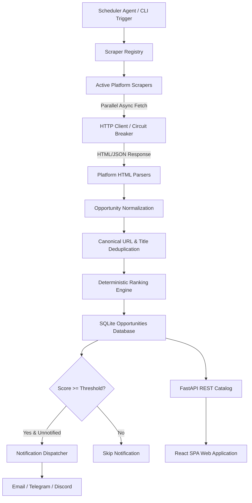

# Discovery Pipeline & Scraper Registry

The Discovery Pipeline in DEDAN Remote continuously scans public career catalogs across 9 specialized remote work and AI-training platforms, extracting, normalizing, deduplicating, scoring, and storing listings.

---

## 1. Pipeline Execution Architecture

---

## 2. Monitored Platforms & Scraper Registry

The Scraper Registry (`scrapers/scraper_registry.py`) manages dynamic discovery and instantiation of all platform scraper subclasses:

| Source Identifier | Scraper Class | Target URL | Extraction Mechanism |
|---|---|---|---|
| `outlier` | `OutlierScraper` | `https://outlier.ai/expert-jobs` | HTML parser, regex compensation extractor |
| `alignerr` | `AlignerrScraper` | `https://www.alignerr.com/careers` | Structured HTML listing parser |
| `oneforma` | `OneFormaScraper` | `https://jobs.oneforma.com/` | Career board table parser |
| `telus` | `TelusScraper` | `https://jobs.telusdigital.com/` | Career portal HTML extractor with title deduplication |
| `welocalize` | `WelocalizeScraper` | `https://jobs.welocalize.com/` | Portal listing parser |
| `appen` | `AppenScraper` | `https://appen.com/careers/` | Structured careers catalog extractor |
| `dataannotation` | `DataAnnotationScraper` | `https://www.dataannotation.tech/` | Landing page / pay rate regex extractor |
| `clickworker` | `ClickworkerScraper` | `https://www.clickworker.com/clickworker-job/` | Task listings parser |
| `toloka` | `TolokaScraper` | `https://toloka.ai/jobs/` | Dual catalog fallback parser |

---

## 3. Reliability, Resilience & Circuit Breakers

### Timeout & Concurrency Controls
- **Default Per-Source Timeout**: 30 seconds (`REQUEST_TIMEOUT=30`).
- **Global Cycle Timeout**: 300 seconds.
- **Concurrent Workers**: Asynchronous semaphore limits concurrent scraper queries (default: 5 concurrent workers) to avoid IP blacklisting and rate throttling.
- **User-Agent Rotation**: Randomized standard browser user-agents attached to each outbound request.

### Exponential Backoff & Retry
- Up to 3 retry attempts on transient network timeouts (`aiohttp.ClientError`).
- Backoff delays: 1s, 2s, 4s with randomized jitter.

### Source Circuit Breaker
- When an individual platform fails consecutively 3 times, its circuit is set to `open`.
- Open circuits skip requests on subsequent discovery cycles for a cooldown window of 30 minutes, preventing wasted system resources on dead upstream endpoints.

---

## 4. Normalization & Deduplication

Each raw listing is parsed into a structured `Job` model (`models/job.py`):
1. **Title Sanitation**: Strips extra whitespace, HTML entities, and formatting artifacts.
2. **URL Normalization**: Strips tracking parameters (`utm_*`, `ref`, `source_tracker`) to establish canonical URLs.
3. **Location Normalization**: Maps regional tags to standard remote identifiers (`Worldwide`, `Remote - US`, `Remote - EMEA`).
4. **Deduplication Check**:
   - Queries `database.job_exists(url)` against SQLite.
   - Secondary check: Exact match on `(company, title)` within 7 calendar days to capture cross-posted platform URLs.

---

## 5. Scoring & Notification Handoff

Once validated and normalized:
1. The **Comprehensive Scorer** runs deterministic rules to generate a composite score from `0.0` to `100.0`.
2. New records are persisted to SQLite (`data/opportunities.db`).
3. For newly discovered jobs with `score >= NOTIFICATION_MIN_SCORE` (default `75.0`):
   - The Notification Dispatcher formats an alert.
   - Dispatches simultaneously across configured channels:
     - **Email** (SMTP / TLS HTML digest)
     - **Telegram** (Telegram Bot API Markdown payload)
     - **Discord** (Discord Webhook JSON Embed)
   - Persists `notified = TRUE` to prevent duplicate notification delivery.
